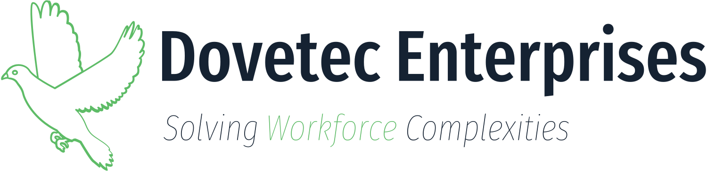

# Dovetec Enterprises Web Platform

Dovetec Enterprises is a Software Engineering and IT Firm based in Nairobi City. We specialize in solving workforce complexities by providing dynamic, user-friendly digital solutions. This repository holds the source code for our primary web platform.



## Overview

The platform is a monolithic, multi-app Django distribution handling everything from marketing (Adverts), robust E-commerce (Shop), a comprehensive Blog and User Portal (Home), to interactive forums (Community).

## Tech Stack

- **Framework**: Django 5.1+
- **Database**: SQLite (local) / PostgreSQL (production) via `dj-database-url`
- **Frontend**: Django Templates with Frost/Bootstrap methodologies
- **Content Editing**: `django-froala-editor` integration
- **Deployment**: Configured for Vercel Serverless Functions (`vercel.json`)

## Architecture Structure

The repository contains several distinct Django apps:
- `home/`: User authentication, profiles, blogging engine, and newsletters.
- `shop/`: E-commerce operations including product catalog, carts, and mock payments.
- `adverts/`: Lead generation and advertisement placements.
- `community/`: Core setup for user community interactions.
- `app/`: General utility routes and static pages.

For a detailed architecture overview, please see [`docs/architecture.md`](docs/architecture.md).

## Installation and Local Setup

1. **Clone the repository:**
   ```bash
   git clone https://github.com/Doveteced/doveteced.github.io.git
   cd doveteced.github.io
   ```

2. **Create a virtual environment and activate it:**
   ```bash
   python -m venv .venv
   source .venv/bin/activate  # On Windows: .venv\Scripts\activate
   ```

3. **Install dependencies:**
   ```bash
   pip install -r requirements.txt
   ```

4. **Run migrations:**
   ```bash
   python manage.py migrate
   ```

5. **Start the development server:**
   ```bash
   python manage.py runserver
   ```
   Navigate to `http://127.0.0.1:8000` in your browser.

## Deployment

The production site is deployed to Vercel from this directory with the CLI:

```bash
npm run deploy:prod      # vercel --prod --archive=tgz
npm run deploy           # preview deployment
```

`--archive=tgz` uploads one compressed archive instead of ~1,100 individual
files, which is far more reliable on slow or high-latency connections.

### Upload size budget (important)

The Vercel CLI only respects `.vercelignore`; patterns in `.gitignore` are
**not** applied to the upload, so anything that should not ship must be listed
in `.vercelignore`. The Hobby plan allows **100 MB of static file uploads** per
deployment (`Pro: 1 GB`); exceeding it makes the CLI abort the upload with
`fetch failed` followed by many `Upload aborted` errors.

Check the payload before deploying:

```bash
npm run check-deploy-size            # 100 MB budget (Hobby)
python3 devops/check_deploy_size.py --limit 1024   # 1 GB budget (Pro)
```

`static/` is excluded on purpose: it is the Django source tree
(`STATICFILES_DIRS`) that `collectstatic` copies into `staticfiles/`, and
`vercel.json` serves `/static/(.*)` from `staticfiles/`. Regenerate the built
assets with `python3 manage.py collectstatic --noinput` (or `build.sh`) before
deploying whenever files under `static/` change.

## Documentation

- [System Architecture](docs/architecture.md)
- [API Documentation](docs/api.md)
- [Benchmarking Report](docs/benchmarking_report.md)

## Contributing

We welcome contributions! Please review our [Contributing Guidelines](CONTRIBUTING.md) before submitting a pull request.

## License

This project is licensed under the MIT License.
